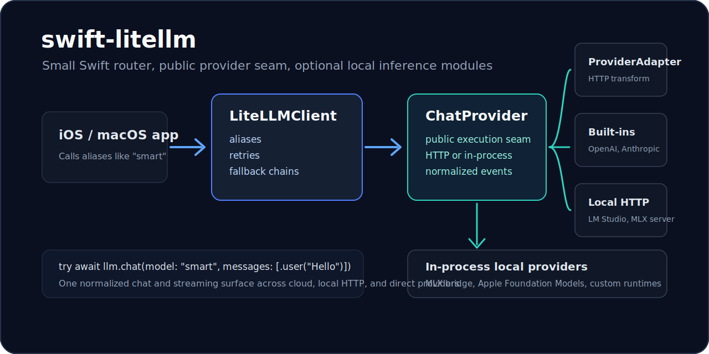

# swift-litellm

[](https://www.swift.org)
[](Package.swift)
[](https://github.com/intelc/swift-litellm/actions/workflows/ci.yml)
[](LICENSE)

**Model routing for native Swift apps.** Configure aliases like `"smart"` and `"local"`, stream normalized events, and fall back across OpenAI-compatible endpoints, Anthropic, Gemini, and Ollama.



- **Aliases instead of provider lock-in:** app code calls `"smart"` or `"fast"`, not scattered provider model IDs.
- **Cloud-first, local-fallback:** route from Anthropic or Gemini to OpenAI-compatible endpoints or local Ollama.
- **LiteLLM-inspired, not a gateway:** no server target, no proxy process, no provider SDK dependencies.

```swift
let response = try await llm.chat(
    model: "smart",
    messages: [.user("Summarize this.")]
)
```

## When To Use This

| You want | Use `swift-litellm`? |
| --- | --- |
| A small router layer inside an iOS/macOS app | Yes |
| User-selectable cloud/local providers | Yes |
| OpenAI-compatible endpoint portability | Yes |
| LiteLLM-style aliases, retries, fallbacks, and metadata | Yes |
| A server gateway, admin UI, budgets, or virtual keys | Use LiteLLM/Bifrost/Portkey instead |
| A broad AI app framework with middleware and agents | Consider Swift AI SDK or Conduit |

## Why This Exists

The Python ecosystem has [LiteLLM](https://github.com/BerriAI/litellm): a Python SDK and AI gateway that exposes 100+ providers through an OpenAI-shaped interface with routing, fallbacks, spend tracking, guardrails, and proxy features.

The Swift ecosystem has strong multi-provider SDKs too:

- [Swift AI SDK](https://github.com/teunlao/swift-ai-sdk) is a broad Vercel AI SDK-style framework for Swift with many provider modules, streaming, tools, structured outputs, middleware, and MCP-oriented workflows.
- [Conduit](https://github.com/christopherkarani/Conduit) is a type-safe Swift framework for cloud and on-device language models, with a strong local/Apple Silicon story through MLX and actor-based providers.

`swift-litellm` aims at a smaller gap:

> A lightweight router layer for native apps that want LiteLLM-style aliases, retries, fallbacks, normalized streaming, provider transforms, and LiteLLM-derived model metadata without running a gateway.

It is not trying to be a full agent framework, a gateway, or a replacement for provider-rich SDKs. It is the small piece you put between app code and model providers when you want model portability to stay boring.

## How It Compares

| Project | Best For | Shape |
| --- | --- | --- |
| [LiteLLM](https://github.com/BerriAI/litellm) | Python apps, AI gateways, provider breadth, proxy features | Python SDK + server gateway |
| [Swift AI SDK](https://github.com/teunlao/swift-ai-sdk) | Full Swift AI SDK surface with tools, structured outputs, middleware, and many modules | Broad provider framework |
| [Conduit](https://github.com/christopherkarani/Conduit) | Type-safe local/cloud inference, Apple Silicon, MLX/CoreML-oriented apps | Native Swift inference framework |
| `swift-litellm` | Lightweight model routing, aliases, fallbacks, normalized chat/streaming for native apps | Small Swift router SDK |

## Install

Add the package to `Package.swift`:

```swift
dependencies: [
    .package(url: "https://github.com/intelc/swift-litellm.git", branch: "main")
]
```

Then add the product to your app target:

```swift
.product(name: "LiteLLM", package: "swift-litellm")
```

For local inference support, also add:

```swift
.product(name: "LiteLLMLocalInference", package: "swift-litellm")
```

## Quick Start

```swift
import Foundation
import LiteLLM

let llm = LiteLLMClient(
    models: [
        "fast": .openAICompatible(
            baseURL: URL(string: "https://openrouter.ai/api")!,
            apiKey: openRouterKey,
            model: "openai/gpt-4o-mini"
        ),
        "smart": .anthropic(
            apiKey: anthropicKey,
            model: "claude-sonnet-4-5"
        ),
        "gemini": .gemini(
            apiKey: geminiKey,
            model: "gemini-2.5-pro"
        ),
        "local": .ollama(
            baseURL: URL(string: "http://localhost:11434")!,
            model: "llama3.2"
        )
    ],
    fallbacks: [
        "smart": ["gemini", "fast", "local"]
    ]
)

let response = try await llm.chat(
    model: "smart",
    messages: [
        .system("Be concise."),
        .user("Summarize this.")
    ]
)

print(response.message.content ?? "")
```

## Routing And Fallbacks

The main abstraction is a model alias. Your UI and features can ask for `"smart"`, while the client decides what concrete provider/model that means.

```swift
let llm = LiteLLMClient(
    models: [
        "smart": .anthropic(apiKey: anthropicKey, model: "claude-sonnet-4-5"),
        "gemini": .gemini(apiKey: geminiKey, model: "gemini-2.5-pro"),
        "fast": .openAICompatible(baseURL: openRouterURL, apiKey: openRouterKey, model: "openai/gpt-4o-mini"),
        "local": .ollama(baseURL: ollamaURL, model: "llama3.2")
    ],
    fallbacks: [
        "smart": ["gemini", "fast", "local"]
    ]
)
```

```text
"smart" → Anthropic → Gemini → OpenAI-compatible → Ollama
```

That is the LiteLLM-inspired part: app code depends on a capability alias, not a single vendor endpoint.

## Streaming

```swift
let stream = try llm.streamChat(
    model: "fast",
    messages: [.user("Draft a short reply.")]
)

for try await event in stream {
    switch event {
    case let .textDelta(text):
        print(text, terminator: "")
    case let .toolCallDelta(toolCall):
        print("tool:", toolCall.name, toolCall.arguments)
    case let .messageCompleted(response):
        print("done:", response.finishReason ?? "unknown")
    case .done:
        break
    }
}
```

## Tool Calls

```swift
let weather = ToolDefinition(
    name: "get_weather",
    description: "Get the current weather for a city.",
    parameters: [
        "type": "object",
        "properties": [
            "city": [
                "type": "string"
            ]
        ],
        "required": ["city"]
    ]
)

let response = try await llm.chat(
    model: "smart",
    messages: [.user("Should I bring a jacket in San Francisco?")],
    tools: [weather]
)

if let call = response.message.toolCalls?.first {
    print(call.name, call.arguments)
}
```

## Credentials

You can configure keys directly on providers, fetch them lazily, or override them for one call.

```swift
let llm = LiteLLMClient(
    models: [
        "smart": .anthropic(model: "claude-sonnet-4-5"),
        "fast": .openAICompatible(baseURL: openRouterURL, apiKey: nil, model: "openai/gpt-4o-mini")
    ],
    apiKeyProvider: { provider, alias in
        switch provider.providerName {
        case "anthropic":
            return keychainString("anthropic-api-key")
        case "openai-compatible":
            return keychainString("\(alias)-api-key")
        default:
            return nil
        }
    }
)

let response = try await llm.chat(
    model: "fast",
    request: ChatRequest(
        messages: [.user("Use this tenant key.")],
        providerOptions: ["api_key": tenantOpenAICompatibleKey]
    )
)
```

A tiny Keychain lookup can stay app-side:

```swift
import Security

func keychainString(_ account: String) -> String? {
    let query: [String: Any] = [
        kSecClass as String: kSecClassGenericPassword,
        kSecAttrAccount as String: account,
        kSecReturnData as String: true,
        kSecMatchLimit as String: kSecMatchLimitOne
    ]
    var item: CFTypeRef?
    guard SecItemCopyMatching(query as CFDictionary, &item) == errSecSuccess,
          let data = item as? Data else {
        return nil
    }
    return String(data: data, encoding: .utf8)
}
```

## Examples

Cloud to local fallback:

```swift
let llm = LiteLLMClient(
    models: [
        "draft": .anthropic(apiKey: anthropicKey, model: "claude-sonnet-4-5"),
        "fast": .openAICompatible(baseURL: openRouterURL, apiKey: openRouterKey, model: "openai/gpt-4o-mini"),
        "local": .ollama(baseURL: URL(string: "http://localhost:11434")!, model: "llama3.2")
    ],
    fallbacks: [
        "draft": ["fast", "local"]
    ],
    retryPolicy: RetryPolicy(maxRetries: 1)
)

let response = try await llm.chat(
    model: "draft",
    messages: [.user("Rewrite this paragraph for a release note.")]
)
```

Tool-call loop:

```swift
let weather = ToolDefinition(
    name: "get_weather",
    description: "Get the current weather for a city.",
    parameters: [
        "type": "object",
        "properties": ["city": ["type": "string"]],
        "required": ["city"]
    ]
)

var messages: [LLMMessage] = [
    .user("Should I bring a jacket in San Francisco?")
]

let first = try await llm.chat(model: "smart", messages: messages, tools: [weather])
messages.append(first.message)

if let call = first.message.toolCalls?.first, call.name == "get_weather" {
    let result = #"{"city":"San Francisco","temp_f":58,"condition":"fog"}"#
    messages.append(LLMMessage(role: .tool, content: .text(result), toolCallID: call.id))
}

let final = try await llm.chat(model: "smart", messages: messages, tools: [weather])
print(final.message.content ?? "")
```

Structured output:

```swift
let schema: JSONValue = [
    "type": "object",
    "properties": [
        "title": ["type": "string"],
        "priority": ["type": "string", "enum": ["low", "medium", "high"]]
    ],
    "required": ["title", "priority"]
]

let response = try await llm.chat(
    model: "fast",
    messages: [.user("Turn this bug report into a triage item: login fails on cold start.")],
    responseFormat: .jsonSchema(name: "triage_item", schema: schema, strict: true)
)

print(response.message.content ?? "")
```

Bring your own OpenAI-compatible endpoint:

```swift
let llm = LiteLLMClient(
    models: [
        "lab": .openAICompatible(
            baseURL: URL(string: "http://localhost:8000")!,
            apiKey: nil,
            model: "local-model"
        )
    ]
)

let response = try await llm.chat(
    model: "lab",
    messages: [.user("Explain this trace in one paragraph.")],
    extraHeaders: ["X-Request-ID": requestID],
    extraBody: ["top_p": 0.9]
)
```

## Local Inference

`LiteLLMLocalInference` adds local providers without making `LiteLLM` own model downloads, tokenizers, caches, or GPU memory. It supports three local paths:

| Path | API | Use when |
| --- | --- | --- |
| Local OpenAI-compatible server | `.lmStudio`, `.llamaCppServer`, `.mlxServer`, `.localOpenAICompatible` | You run LM Studio, llama.cpp server, SwiftLM, MLX server, vLLM, or another local `/v1/chat/completions` endpoint |
| In-process MLX bridge | `.mlxInProcess` | Your app owns an MLX Swift runtime and wants `swift-litellm` routing/fallbacks around it |
| Apple Foundation Models | `.appleFoundationModel` | You want Apple's on-device system model when `FoundationModels` is available |

Local providers are normal route targets, so they can be primary models or fallback targets:

```swift
import LiteLLM
import LiteLLMLocalInference

let llm = LiteLLMClient(
    models: [
        "smart": .anthropic(apiKey: anthropicKey, model: "claude-sonnet-4-5"),
        "local": .lmStudio(model: "qwen2.5")
    ],
    fallbacks: [
        "smart": ["local"]
    ]
)
```

### Local HTTP

Use these when a local runtime exposes an OpenAI-compatible HTTP API:

```swift
import LiteLLM
import LiteLLMLocalInference

let llm = LiteLLMClient(
    models: [
        "local": .lmStudio(model: "qwen2.5"),
        "llama": .llamaCppServer(model: "llama-3.2"),
        "mlx": .mlxServer(model: "mlx-community/Qwen2.5-7B-Instruct-4bit")
    ]
)
```

Defaults:

| Factory | Default URL | Provider name |
| --- | --- | --- |
| `.lmStudio(model:)` | `http://localhost:1234` | `lm-studio` |
| `.llamaCppServer(model:)` | `http://localhost:8080` | `llama.cpp` |
| `.mlxServer(model:)` | `http://localhost:8080` | `mlx-server` |
| `.localOpenAICompatible(baseURL:model:)` | caller-provided | `local-openai-compatible` |

### In-Process MLX

```swift
import LiteLLM
import LiteLLMLocalInference

let llm = LiteLLMClient(
    models: [
        "mlx": .mlxInProcess(model: "mlx-community/Qwen2.5-7B-Instruct-4bit") { request, prompt in
            // Call your MLX Swift model/tokenizer here and return generated text.
            try await mlxRuntime.generate(prompt)
        }
    ]
)
```

The MLX entry point is closure-backed on purpose. MLX Swift integrations often own model loading, tokenization, download/cache policy, and sampling parameters app-side, so `swift-litellm` supplies the routing surface without forcing one MLX runtime shape.

For a more mature native Swift local-inference implementation, see [Conduit](https://github.com/christopherkarani/Conduit). `swift-litellm` keeps the local layer deliberately small: it borrows the idea of native provider boundaries, but leaves heavyweight runtime concerns such as model loading, tokenizer ownership, caching, and Apple Silicon tuning to app code or dedicated inference frameworks.

Long-running local runtimes can also provide a cancellation hook:

```swift
"mlx": .mlxInProcess(
    model: "mlx-community/Qwen2.5-7B-Instruct-4bit",
    generate: { request, prompt in try await mlxRuntime.generate(prompt) },
    stream: { request, prompt in mlxRuntime.stream(prompt) },
    cancel: { mlxRuntime.cancelGeneration() }
)
```

### Apple Foundation Models

```swift
import LiteLLM
import LiteLLMLocalInference

if #available(iOS 26.0, macOS 26.0, *) {
    let llm = LiteLLMClient(
        models: [
            "apple-local": .appleFoundationModel(
                instructions: "Answer briefly."
            )
        ]
    )
}
```

When Apple's `FoundationModels` framework is unavailable, the factory still compiles and routes but throws a provider-unavailable error. That keeps app code and fallback chains buildable across SDK versions.

### Local Scope

`swift-litellm` local inference intentionally covers:

- alias routing, retries, and fallbacks across cloud and local models
- normalized `ChatResponse` and `StreamEvent` output
- local HTTP presets for OpenAI-compatible runtimes
- closure-backed in-process model bridges
- cancellation hooks for long-running local generation
- a Foundation Models provider that is routeable across SDK versions

It intentionally does not own:

- MLX/CoreML model download or cache policy
- tokenizer setup
- memory limits, warmup, or Apple Silicon tuning
- full local runtime lifecycle management

For those heavier runtime concerns, [Conduit](https://github.com/christopherkarani/Conduit) is the mature Swift local-inference reference point.

Custom chat providers:

```swift
struct MyLocalProvider: ChatProvider {
    let model: String
    var providerName: String { "my-local-provider" }
    var apiKey: String? { nil }

    func withAPIKey(_ apiKey: String) -> any ChatProvider {
        self
    }

    func chat(_ request: ChatRequest, context: ProviderContext) async throws -> ChatResponse {
        // Run an in-process model here, or delegate to any non-HTTP runtime.
        ChatResponse(model: model, message: .assistant("ok"), provider: providerName)
    }

    func streamChat(_ request: ChatRequest, context: ProviderContext) -> AsyncThrowingStream<StreamEvent, Error> {
        AsyncThrowingStream { continuation in
            continuation.yield(.textDelta("ok"))
            continuation.yield(.done)
            continuation.finish()
        }
    }
}

let llm = LiteLLMClient(
    models: [
        "custom": Provider(chatProvider: MyLocalProvider(model: "my-model"))
    ]
)
```

For custom HTTP providers, implement `ProviderAdapter` instead. The router wraps adapters as `ChatProvider`s so HTTP and in-process providers share the same alias, retry, fallback, chat, and streaming behavior.

## What You Get

- **Model aliases:** call `"smart"`, `"fast"`, or `"local"` from app code instead of hardcoding provider model IDs everywhere.
- **Fallback chains:** fail from Anthropic to Gemini to OpenAI-compatible to local Ollama.
- **OpenAI-compatible first:** works with OpenRouter, LiteLLM proxy, vLLM, LM Studio, and other OpenAI-shaped endpoints.
- **Chat providers:** plug custom HTTP or in-process providers into the same routing, retry, fallback, chat, and streaming surface.
- **Local inference:** import `LiteLLMLocalInference` for LM Studio, llama.cpp server, MLX server, generic local OpenAI-compatible endpoints, closure-backed in-process MLX, and Apple Foundation Models when available.
- **Native-app friendly:** Swift 6, async/await, `URLSession`, no server framework dependency.
- **Normalized outputs:** one `ChatResponse`, one `StreamEvent`, one `ToolCall` shape.
- **LiteLLM metadata:** bundled model pricing/context/provider metadata generated from LiteLLM resources.
- **Testable transforms:** provider adapters are pure enough to fixture-test request and response parity.

## Provider Matrix

| Provider | Chat | Streaming | Tools | JSON mode intent | Usage | Status |
| --- | --- | --- | --- | --- | --- | --- |
| OpenAI-compatible | Yes | Yes | Yes | Yes | Yes | Early |
| Anthropic | Yes | Yes | Yes | Basic | Yes | Early |
| Gemini | Yes | Yes | Yes | Basic | Yes | Early |
| Ollama | Yes | Yes | Basic | Basic | Basic | Early |
| LiteLLMLocalInference presets | Yes | Yes | Yes | Yes | Yes | OpenAI-compatible local servers |
| MLX in-process bridge | Yes | Yes | App-defined | App-defined | App-defined | Closure-backed |
| Apple Foundation Models | Yes | Yes | Framework-defined | Framework-defined | Framework-defined | Conditional on `FoundationModels` |
| Custom `ChatProvider` | Provider-defined | Provider-defined | Provider-defined | Provider-defined | Provider-defined | Public execution seam |
| Custom `ProviderAdapter` | Adapter-defined | Adapter-defined | Adapter-defined | Adapter-defined | Adapter-defined | Public seam |

OpenAI-compatible endpoints include services such as OpenRouter, LiteLLM proxy, vLLM, LM Studio, and any endpoint that implements `/v1/chat/completions`.

## Current Scope

Supported in this early V1:

- Chat completions
- Streaming chat
- Basic tool definition and tool-call normalization
- Basic structured-output / JSON-mode intent
- Usage normalization
- Retries and fallbacks
- LiteLLM-derived model metadata
- Providers: OpenAI-compatible, Anthropic, Gemini, Ollama
- Public `ChatProvider` extensibility for in-process or non-HTTP providers
- Public `ProviderAdapter` extensibility
- Optional `LiteLLMLocalInference` local HTTP presets
- Optional `LiteLLMLocalInference` in-process providers for MLX bridges and Apple Foundation Models

Out of scope for now:

- Gateway/server target
- Admin UI, virtual keys, budgets, spend tracking, caching, guardrails
- Embeddings, images, audio, batches, rerank
- OpenAI Responses API
- Full agent loop or MCP client
- Owning MLX model download/cache/tokenizer lifecycle
- CoreML text-generation runtime

## Model Metadata

`swift-litellm` ships generated metadata from LiteLLM:

- `model_prices_and_context_window.json`
- `provider_endpoints_support.json`
- `litellm-upstream.json`

Use it directly:

```swift
if let info = ModelMetadata.info(for: "gpt-4o-mini") {
    print(info.litellmProvider ?? "unknown")
    print(info.maxInputTokens ?? 0)
    print(info.supportsFunctionCalling ?? false)
}

if llm.supports(.tools, model: "fast") {
    print("tool calling is available")
}
```

Refresh the metadata from a local LiteLLM checkout:

```bash
python3 Scripts/sync_litellm_metadata.py --litellm-dir /path/to/litellm
```

Validate the checked-in resources:

```bash
python3 Scripts/sync_litellm_metadata.py --check
```

Opt into live provider smoke tests by setting the provider credentials you want to exercise:

```bash
OPENAI_API_KEY=... swift test
ANTHROPIC_API_KEY=... swift test
GEMINI_API_KEY=... swift test
OLLAMA_BASE_URL=http://localhost:11434 swift test
```

The live tests also accept `OPENAI_BASE_URL`, `OPENAI_MODEL`, `ANTHROPIC_MODEL`, `GEMINI_MODEL`, and `OLLAMA_MODEL` overrides.

## Roadmap

The next work is tracked in [TODO.md](TODO.md). The immediate priority is deeper provider parity:

- splitting built-in providers into optional products if that proves useful
- deeper in-process local inference behind `LiteLLMLocalInference`
- richer provider parity fixtures
- structured output quirks
- opt-in live tests
- streaming accumulation helpers
- model capability helpers
- better key-provider ergonomics for apps

## Safety

This repo includes a local pre-commit hook at `.githooks/pre-commit` that blocks common API keys, private keys, and accidental `.env` commits.

Enable it after cloning:

```bash
git config core.hooksPath .githooks
```

## Development

```bash
swift test
python3 Scripts/sync_litellm_metadata.py --check
```

The test suite covers provider request transforms, response parsing, streaming event parsing, router retry/fallback/cancellation behavior, and metadata loading.

## License

MIT. LiteLLM-derived metadata is generated from the upstream LiteLLM project; see `Sources/LiteLLM/Resources/metadata/litellm-upstream.json` for the pinned source commit.
